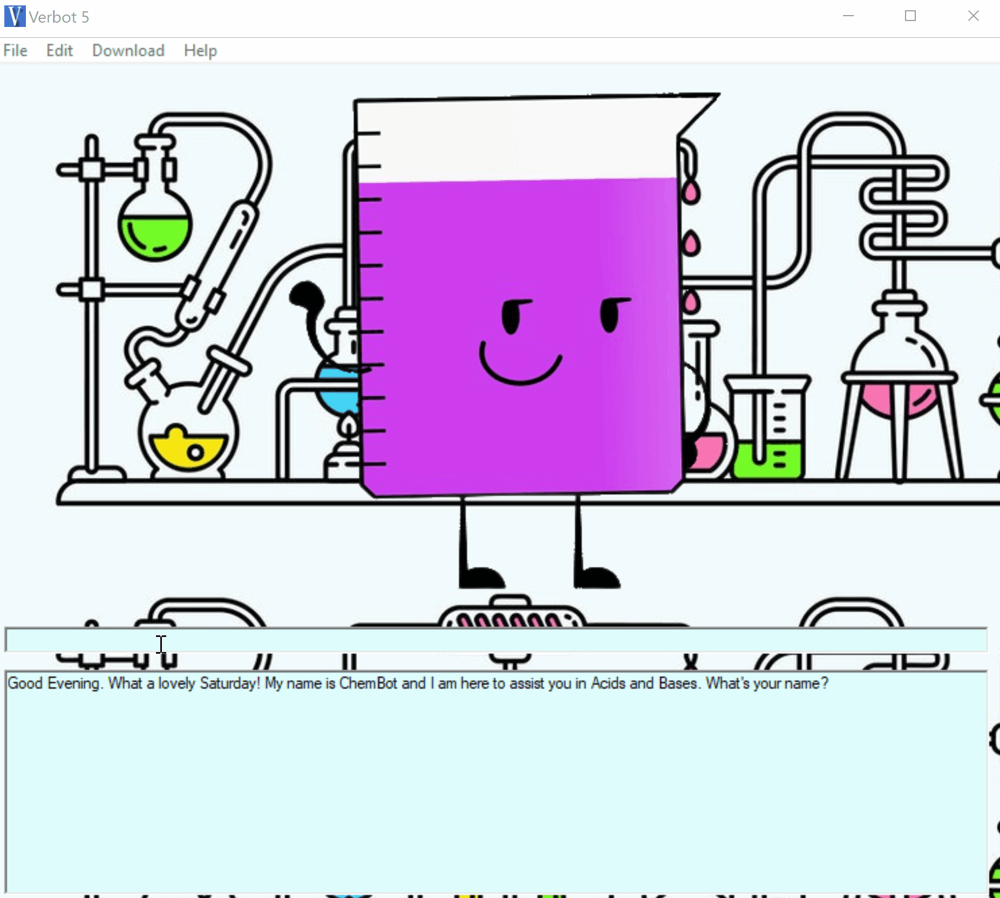
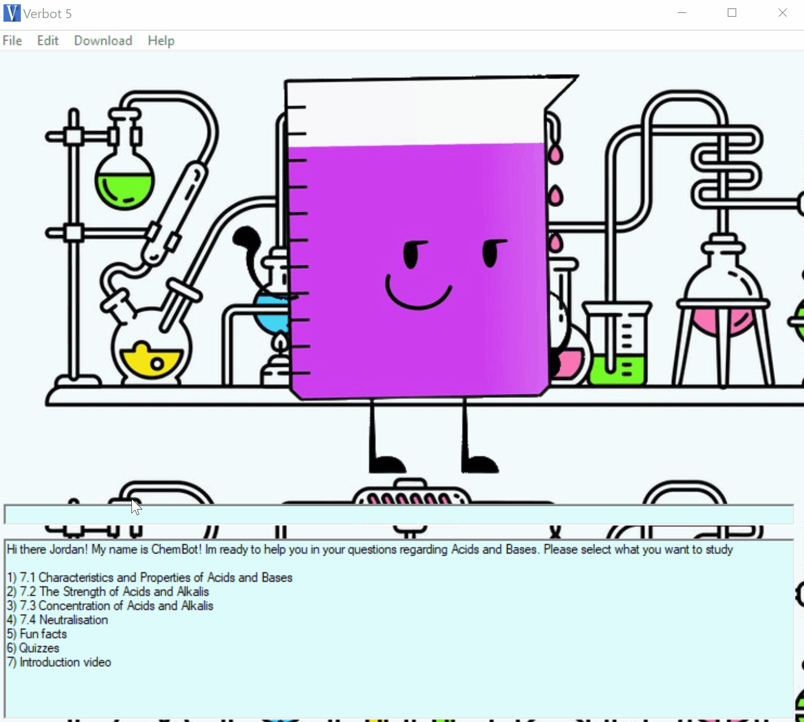
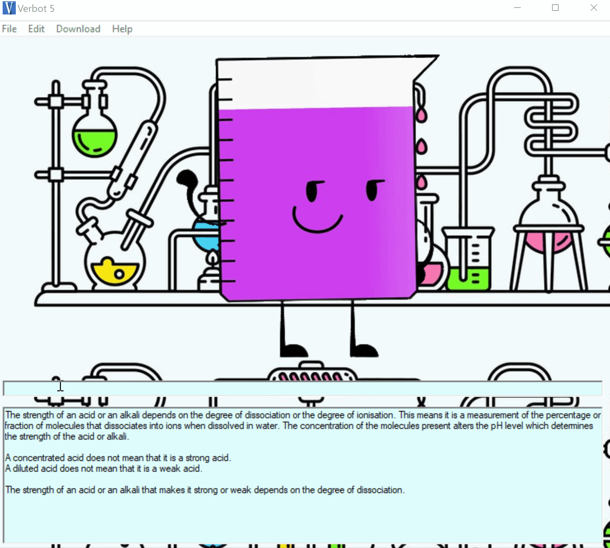

# AI-Chatbot-System
It is an Artificial Intelligence Chatbot application used to conduct live conversations via text with the use of inputs, outputs and synonyms.
## Functionalities
  •	Name recognition.   
  •	Able to greet users based on day and time during startup.
    •	Remembering users' last input. 
    •	Speaking up automatically when input hasn't been entered for as long as 10 minutes.
    •	Inform users when non-existent inputs are entered.
    •	Respond to users based on existing inputs and outputs.
    •	Provide quizzes.

## Getting Started
1. Install  [Verbot Player & Verbot Editor](https://download.cnet.com/Verbot/3000-31711_4-10277575.html) for framework.
2. Install  [Conversive Character Studio](https://conversive-character-studio.software.informer.com/) to create motion character based on mouth movements.
3. Run the Verbot Player using [Ben2.vsk](/AI-Chatbot-System/Ben2.vsk).
4. In Verbot Player, go to Edit > Options > Knowledge Base. Insert [stitch.vkb](/AI-Chatbot-System/stitch.vkb) into the knowledge base. 
5. Run the program.

## Demos and Screenshot 

-----

  <h2>Start-Up</h2>

-----

  <h2>Name Recognition</h2>

-----

  <h2>User Input</h2>

-----

  <h2>Users' Last Input</h2>

-----

